<div align="center">


<a href="https://github.com/muhammad-musab03"></a>

<br/>

<a href="https://www.linkedin.com/in/rana-musab"></a>
<a href="https://www.instagram.com/_musab_rana"></a>
<a href="https://www.tiktok.com/@musab_rana"></a>


</div>

### 🌱 About Me

```python
musab = Student(
    degree   = "BS Computer Science",
    location = "Bhakkar, Punjab, Pakistan 📍",
    learning = ["Artificial Intelligence", "Machine Learning",
                "LLMs", "Generative AI", "Conversational AI"],
    building = ["ChatGPT Mini Bot 🤖", "more coming soon..."],
    goals    = ["Sharpen ML fundamentals",
                "Go deeper on LLMs",
                "Build a professional AI/ML portfolio",
                "Land an internship 🚀"],
)
```

### 🛠️ Tech Stack

<div align="center">

**💻 Programming**<br/>
<br/>


**🧠 AI / ML**<br/>


**📊 Data & Python**<br/>


**🔧 Tools**<br/>
<br/>


</div>

### 🚀 Projects

<div align="center">

| Project | What it is | Built with |
| :--- | :--- | :--- |
| **🤖 ChatGPT Mini Bot** | A small chatbot built while learning AI, LLMs and conversational AI | `Python` |

</div>

### 📊 GitHub Stats

<div align="center">






</div>

### 🐍 Contribution Snake

<div align="center">
<picture>
  <source media="(prefers-color-scheme: dark)" srcset="https://raw.githubusercontent.com/muhammad-musab03/muhammad-musab03/output/github-snake-dark.svg" />
  <source media="(prefers-color-scheme: light)" srcset="https://raw.githubusercontent.com/muhammad-musab03/muhammad-musab03/output/github-snake.svg" />
  
</picture>
</div>

<div align="center">

**Learn • Build • Improve**

</div>


